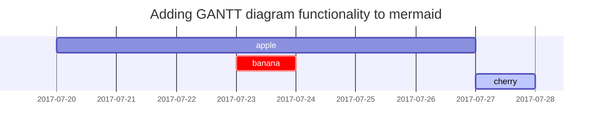

## **컴파일**
{: .mt-0 .mb-2 }
소스코드를 기계어나 중간 언어로 변환하는 과정
컴파일러라고 불리는 도구를 사용하여 소스코드를 기계어나 중간 언어로 번역
컴파일러는 소스 코드의 구문 오류를 찾아내고 코드를 최적화하여 실행가능한 형태로 만듬
컴파일 단계에서 생성된 실행 파일은 컴퓨터에서 직접 실행가능하다.

## **빌드**
{: .mt-5 .mb-2 }
빌드는 프로그램 개발 과정에서 여러 단계를 거쳐 소프트웨어를 완성하는 과정

## **스트림 프로세싱(= 이벤트 스트림 프로세싱, ESP)**
{: .mt-5 .mb-2 }
스트림 프로세싱은 스트리밍 데이터가 레코드나 정의된 단위에 따라 순차적으로 처리되는것을 의미한다.
스트림 프로세싱과 일괄처리를 상호 보완적으로 사용하는 경우도 있다.
금융거래, 시장, 통화 상태 모니터링, 보안 탐지나 시스템 실시간 분석과 같은 스트리밍 분석 또는 실시간 분석에 사용되는 기술이다.

### **특징**
{: .mt-2 .mb-1}
-연속되는 실시간 데이터 처리를위한 기술  
-연속되는 실시간 데이터를 처리하기 때문에 빠르고 효율적인 데이터 활용이 가능.  
-스트림 프로세싱은 빅데이터의 특징인 5V중 속도(Velocity)를 단축시키는 것과 밀접한 관련이 있다.  
-스트리밍 데이터를 활용하면 처리 속도가 빨라져 데이터 공유와 분석에 이점이 있다. 스트리밍 데이터 활용은 실시간 대응이 중요한 분야에서 비즈니스 경쟁력에 중요한 영향을 미치기때문에 스트림 프로세싱이 더욱더 중요하다.  
-스트리밍 데이터는 복수의 데이터 소스로부터 연속적으로 생성되는 데이터 레코드로 대부분 KB 단위 크기이다.  
-데이터가 연속해서 계속 흘러가기 때문에 처리할 수 있는 기회가 한정적이고 처리할 수 없는 데이터는 버려질 수도 있다.

##### **이벤트 처리 보장** : 분산 데이터 파이프라인에서 데이터를 전달하는 방법 3가지 방법이 있다
{: .mt-4 .mb-0}
- At least once : 최소 한번의 전달 보장, 데이터 전송 후 전달 완료가 확인되지 않아 타임아웃되면 재전송, 데이터가 중복으로 수신되어도 무방한 경우에 사용
- At most once : 한 번의 전송만 수행, 지연이나 유실이 발생해도 데이터를 재전송하지 않음, 데이터를 수신하지 않아도 무방한 경우 사용
- Exactly once : 정확하게 한 번의 전달만 보장

##### **내결함성** : 장애가 발생하면 복구하여 처리 시점부터 재개할 수 있는 기능
{: .mt-0 .mb-0}
- 플링크의 경우 이벤트 스트림이 메모리에 적재되기 때문에 시스템이 갑작스럽게 중단되면 처리중이던 데이터의 복구가 어려울 수 있다. 이를 방지하기 위해 세이브 포인트 기능으로 현재 메모리에 적재된 내용의 스냅샷을 영구 저장소에 백업하는 기능을 지원

##### **상태관리** : 입력 데이터의 현재 상태 관리를 위해 실시간으로 유입되는 데이터에 워터마크나 유한 크기로 분할해 처리하는 위도우 개념을 적용하기도 함.
{: .mt-0 .mb-0}

### **형태**
{: .mt-4 .mb-1}
스트림 프로세싱은 구현 방법에 따라 네이티브 스트림(Native Stream), 소규모 일괄처리(Micro Batch) 형태로 구분할 수 있다.

##### **네이티브 스트림** : 장애가 발생하면 복구하여 처리 시점부터 재개할 수 있는 기능
{: .mt-0 .mb-4}

##### **소규모 일괄처리** : 네이티브 스트림 대비 지연시간 있음
{: .mt-0 .mb-0}

### **종류**
{: .mt-4 .mb-3}

**아파치 스파크** : 스트림을 소규모 일괄처리하는 형태, 지연이 발생하지만 가장 활성화되어 있는 스트림 프로세서 중 하나, Exactly once의 이벤트 처리를 보장한다. 사용이 어렵지만 고급 분석 기능을 제공   
**아파치 스톰** : 지연이 매우 짧고 복잡하지 않은 스트림에 적합. 하지만 MIcro-batching 스트림 모델인 스톰 트라이던트를 사용하지 않으면 At least once의 이벤트 처리를 보장한다. 또한 상태관리가 지원되지 않아 집계, 윈도우, 워터마크등을 사용할 수 없기 때문에 고급 분석에 제약이 있다.   
**아파치 카프카 스트림즈** : 카프카 스트림즈는 카프카 기능의 일부로 스트림 프로세싱을 위한 경량 라이브러리이다. 스파크나 플링크보다 강력하진 않지만 Exactly-once의 이벤트 처리를 보장, 다른 스트림 프로세서들이 실행 프레임워크인 것에 비해 사용이 쉽다는 이점.   
**아파치 플링크** :  Exactly-once의 이벤트 처리를 보장하는 네이티브 스트림 방식, 지연 발생이 적고 처리량은 높으며 비교적 사용하기 쉽다. 일괄처리 기능도 제공하지만 스트림 프로세싱을 목적으로 주로 사용. 

## **주피터 노트북**
{: .mt-5 .mb-2 }
오픈소스 기반의 웹플랫폼, 파이썬을 비롯한 다양한 프로그래밍 언어로 코드 작성 및 실행하는 개발 환경.

## **IaC(InfraStructure as Code) - 코드형 인프라**
{: .mt-5 .mb-2 }
IT 인프라 프로비저닝을 자동화하는 기술적인 하이 레벨 코딩 언어. 애플리케이션을  개발, 테스트, 배포 할 때마다 서버, 운영체제, DB연결, 스토리지 및 기타 인프라 요소를 수동으로 프로비저닝 및 관리할 필요가 없다.  

IaC는 경쟁력있는 속도로 진행되는 소프트웨어 제공 라이프사이클에 필수불가결한 DevOps 프랙티스이다.  

코드형 인프라는 개발자가 스크립트를 실행하여 완전 문서화되고 버전화된 인프라를 효과적으로 완료할 수 있는 마지막 단계를 수행한다.

#### H4 - heading
{: data-toc-skip='' .mt-4 }

## Paragraph

Quisque egestas convallis ipsum, ut sollicitudin risus tincidunt a. Maecenas interdum malesuada egestas. Duis consectetur porta risus, sit amet vulputate urna facilisis ac. Phasellus semper dui non purus ultrices sodales. Aliquam ante lorem, ornare a feugiat ac, finibus nec mauris. Vivamus ut tristique nisi. Sed vel leo vulputate, efficitur risus non, posuere mi. Nullam tincidunt bibendum rutrum. Proin commodo ornare sapien. Vivamus interdum diam sed sapien blandit, sit amet aliquam risus mattis. Nullam arcu turpis, mollis quis laoreet at, placerat id nibh. Suspendisse venenatis eros eros.

## Lists

### Ordered list

1. Firstly
2. Secondly
3. Thirdly

### Unordered list

- Chapter
  + Section
    * Paragraph

### ToDo list

- [ ] Job
  + [x] Step 1
  + [x] Step 2
  + [ ] Step 3

### Description list

Sun
: the star around which the earth orbits

Moon
: the natural satellite of the earth, visible by reflected light from the sun

## Block Quote

> This line shows the _block quote_.

## Prompts

> An example showing the `tip` type prompt.
{: .prompt-tip }

> An example showing the `info` type prompt.
{: .prompt-info }

> An example showing the `warning` type prompt.
{: .prompt-warning }

> An example showing the `danger` type prompt.
{: .prompt-danger }

## Tables

| Company                      | Contact          | Country |
|:-----------------------------|:-----------------|--------:|
| Alfreds Futterkiste          | Maria Anders     | Germany |
| Island Trading               | Helen Bennett    | UK      |
| Magazzini Alimentari Riuniti | Giovanni Rovelli | Italy   |

## Links

<http://127.0.0.1:4000>

## Footnote

Click the hook will locate the footnote[^footnote], and here is another footnote[^fn-nth-2].

## Inline code

This is an example of `Inline Code`.

## Filepath

Here is the `/path/to/the/file.extend`{: .filepath}.

## Code blocks

### Common

```
This is a common code snippet, without syntax highlight and line number.
```

### Specific Language

```bash
if [ $? -ne 0 ]; then
  echo "The command was not successful.";
  #do the needful / exit
fi;
```

### Specific filename

```sass
@import
  "colors/light-typography",
  "colors/dark-typography";
```
{: file='_sass/jekyll-theme-chirpy.scss'}

## Mathematics

The mathematics powered by [**MathJax**](https://www.mathjax.org/):

$$ \sum_{n=1}^\infty 1/n^2 = \frac{\pi^2}{6} $$

When $a \ne 0$, there are two solutions to $ax^2 + bx + c = 0$ and they are

$$ x = {-b \pm \sqrt{b^2-4ac} \over 2a} $$

## Mermaid SVG



## Images

### Default (with caption)

{: width="972" height="589" }
_Full screen width and center alignment_

### Left aligned

{: width="972" height="589" .w-75 .normal}

### Float to left

{: width="972" height="589" .w-50 .left}
Praesent maximus aliquam sapien. Sed vel neque in dolor pulvinar auctor. Maecenas pharetra, sem sit amet interdum posuere, tellus lacus eleifend magna, ac lobortis felis ipsum id sapien. Proin ornare rutrum metus, ac convallis diam volutpat sit amet. Phasellus volutpat, elit sit amet tincidunt mollis, felis mi scelerisque mauris, ut facilisis leo magna accumsan sapien. In rutrum vehicula nisl eget tempor. Nullam maximus ullamcorper libero non maximus. Integer ultricies velit id convallis varius. Praesent eu nisl eu urna finibus ultrices id nec ex. Mauris ac mattis quam. Fusce aliquam est nec sapien bibendum, vitae malesuada ligula condimentum.

### Float to right

{: width="972" height="589" .w-50 .right}
Praesent maximus aliquam sapien. Sed vel neque in dolor pulvinar auctor. Maecenas pharetra, sem sit amet interdum posuere, tellus lacus eleifend magna, ac lobortis felis ipsum id sapien. Proin ornare rutrum metus, ac convallis diam volutpat sit amet. Phasellus volutpat, elit sit amet tincidunt mollis, felis mi scelerisque mauris, ut facilisis leo magna accumsan sapien. In rutrum vehicula nisl eget tempor. Nullam maximus ullamcorper libero non maximus. Integer ultricies velit id convallis varius. Praesent eu nisl eu urna finibus ultrices id nec ex. Mauris ac mattis quam. Fusce aliquam est nec sapien bibendum, vitae malesuada ligula condimentum.

### Dark/Light mode & Shadow

The image below will toggle dark/light mode based on theme preference, notice it has shadows.

{: .light .w-75 .shadow .rounded-10 w='1212' h='668' }
{: .dark .w-75 .shadow .rounded-10 w='1212' h='668' }

## Video



## Reverse Footnote

[^footnote]: The footnote source
[^fn-nth-2]: The 2nd footnote source
