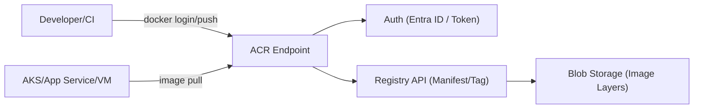
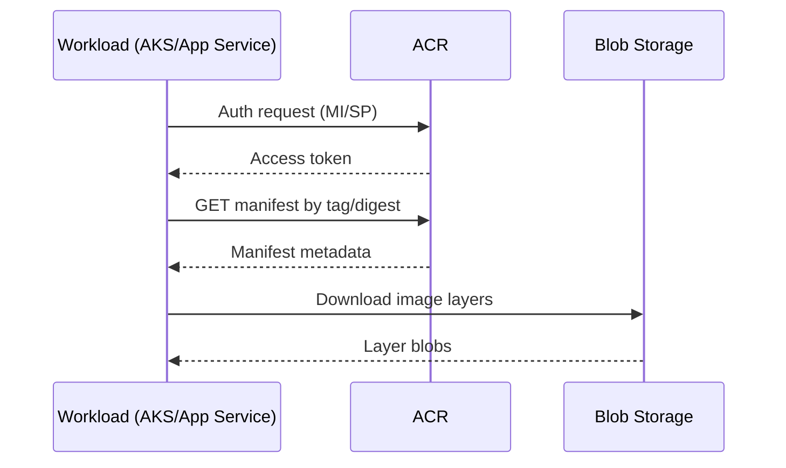

ACR은 Azure에서 제공하는 컨테이너 이미지 전용 프라이빗 레지스트리 서비스이다.

## **ACR이란?**
{: .mt-5 .mb-2}
ACR(Azure Container Registry)은 Docker/OCI 이미지를 저장, 버전관리, 배포할 수 있는 Azure 관리형 레지스트리다.
팀이나 조직이 직접 만든 이미지를 안전하게 보관하고, Kubernetes/VM/App Service 같은 실행 환경에서 이미지를 가져갈 때 사용한다.

## **핵심 특징**
{: .mt-5 .mb-2}
- Azure 리소스와 자연스럽게 연동된다.
- Private Registry로 내부 이미지 유출 위험을 낮출 수 있다.
- 태그/버전 관리로 배포 이력을 추적하기 쉽다.
- 네트워크 접근 제어(방화벽, Private Endpoint) 구성이 가능하다.

## **기본 동작 흐름**
{: .mt-5 .mb-2}
1. 애플리케이션을 Docker 이미지로 빌드한다.
2. 이미지를 ACR에 `push`한다.
3. 배포 대상(AKS, App Service 등)이 ACR에서 이미지를 `pull`한다.
4. 새 버전 이미지를 올리고 태그를 바꿔 롤링 배포한다.

## **내부 아키텍처 구조**
{: .mt-5 .mb-2}
ACR은 크게 인증 계층, 레지스트리 API 계층, 스토리지 계층으로 나눠서 이해하면 쉽다.

- **인증 계층**: Microsoft Entra ID(구 Azure AD), Service Principal, Managed Identity 기반으로 토큰 발급
- **레지스트리 API 계층**: Docker Registry v2/OCI API 처리, 이미지 manifest와 tag 조회/관리
- **스토리지 계층**: 실제 이미지 layer/blob가 Azure Storage에 저장됨

## **이미지 Pull 시 인증 흐름**
{: .mt-5 .mb-2}
실행 환경이 이미지를 가져갈 때는 보통 아래 순서로 동작한다.

1. 워크로드(AKS 노드/Pod, App Service)가 ACR 접근 자격(Managed Identity 등)으로 인증 요청
2. ACR이 토큰을 발급
3. 워크로드가 토큰으로 manifest를 조회
4. 필요한 layer(blob)만 내려받아 컨테이너를 실행

## **언제 쓰면 좋은가**
{: .mt-5 .mb-2}
- Azure 기반으로 서비스 인프라를 운영할 때
- 사내 전용 컨테이너 이미지를 중앙 저장소로 관리하고 싶을 때
- CI/CD 파이프라인에서 이미지 빌드부터 배포까지 일관되게 운영하고 싶을 때

## **운영 시 체크 포인트**
{: .mt-5 .mb-2}
- `latest` 태그만 쓰지 말고 버전 태그를 함께 사용한다.
- 오래된 태그/이미지는 정리 정책을 만들어 저장소 비용을 관리한다.
- 서비스별 Pull 권한을 최소 권한 원칙으로 분리한다.
- 운영 환경 배포는 tag보다 digest(`@sha256:...`) 기준 고정을 우선 고려한다.
