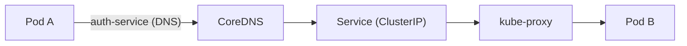
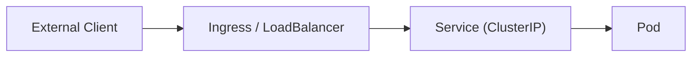

쿠버네티스 네트워크를 이해할 때 핵심은 `system pod의 역할`과 `Service 기반 통신 흐름`이다.

## **핵심 결론**
{: .mt-5 .mb-2}
- CoreDNS, kube-proxy, metrics-server는 클러스터 운영을 위한 핵심 구성요소다.
- 이들은 "system pod 위에서 실행"되는 것이 아니라, **자체가 system pod(또는 system 컴포넌트)**로 동작한다.
- 내부 Pod 간 통신은 보통 Service DNS 이름을 사용한다.
- 외부에서 ClusterIP를 직접 호출할 수 없고, Ingress/LoadBalancer를 통해 접근한다.

## **CoreDNS**
{: .mt-5 .mb-2}
- 역할: 클러스터 내부 DNS 서버
- 기능: `service 이름 -> ClusterIP` 변환
- 예시:
  - `http://auth-service`
  - `http://auth-service.default.svc.cluster.local`

CoreDNS가 비정상이면 이름 기반 통신이 실패해 내부 호출이 크게 흔들릴 수 있다.

## **kube-proxy**
{: .mt-5 .mb-2}
- 역할: Service 트래픽을 실제 Pod로 전달
- 기능: iptables/IPVS 규칙으로 Service 가상 IP를 백엔드 Pod로 라우팅

흐름:
`Client -> Service(ClusterIP) -> Pod`

## **metrics-server**
{: .mt-5 .mb-2}
- 역할: CPU/메모리 사용량 수집
- 없으면 `kubectl top node`, `kubectl top pod`가 동작하지 않는다.
- HPA(Horizontal Pod Autoscaler)가 이 데이터를 활용한다.

## **System Pod란?**
{: .mt-5 .mb-2}
`system pod`는 특정 제품명이 아니라, 클러스터 운영을 위해 필요한 Pod들의 분류다.

대표 예시:
- CoreDNS
- metrics-server
- ingress controller
- CNI 플러그인(calico 등)

보통 `kube-system` 네임스페이스에서 동작한다.

## **"system pod 위에서 돌아간다?"에 대한 정확한 표현**
{: .mt-5 .mb-2}
- 부정확한 표현: "CoreDNS가 system pod 위에서 돌아간다"
- 정확한 표현: "CoreDNS가 system pod로서 노드 위에서 실행된다"

즉, 실행 계층은 `Node -> Pod`이고, system pod는 그 Pod의 역할 분류다.

## **내부 통신 vs 외부 접근**
{: .mt-5 .mb-2}

### **내부 Pod 간 통신**
{: .mt-4 .mb-2}
보통 Service DNS 이름으로 호출한다.

### **외부에서 클러스터 접근**
{: .mt-4 .mb-2}
`ClusterIP`는 내부 전용이므로 외부에서 직접 접근할 수 없다.
외부 접근은 보통 `LoadBalancer` 또는 `Ingress`를 통해 들어온다.

## **Service 타입과 외부 접근**
{: .mt-5 .mb-2}

| 타입 | 외부 접근 | 설명 |
|---|---|---|
| ClusterIP | 불가 | 클러스터 내부 전용 |
| NodePort | 가능 | `NodeIP:Port`로 접근 |
| LoadBalancer | 가능 | 클라우드 LB IP로 접근 |
| Ingress | 가능 | 도메인/경로 기반 라우팅 |

## **정리**
{: .mt-5 .mb-2}
- 내부 호출: Service DNS 이름 사용
- 외부 호출: Ingress/LoadBalancer 사용
- CoreDNS는 이름 해석, kube-proxy는 트래픽 전달, metrics-server는 리소스 지표 수집을 담당
- ClusterIP는 외부 공개용 IP가 아니다
