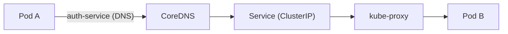
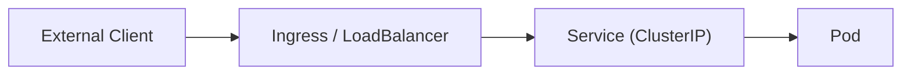
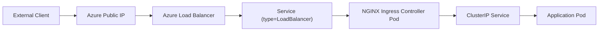

쿠버네티스 네트워크를 이해할 때 핵심은 `system pod의 역할`과 `Service 기반 통신 흐름`이다.

## **핵심 결론**
{: .mt-5 .mb-2}
- CoreDNS, kube-proxy, metrics-server는 클러스터 운영을 위한 핵심 구성요소다.
- 이들은 "system pod 위에서 실행"되는 것이 아니라, **자체가 system pod(또는 system 컴포넌트)**로 동작한다.
- 내부 Pod 간 통신은 보통 Service DNS 이름을 사용한다.
- 외부에서 ClusterIP를 직접 호출할 수 없고, Ingress/LoadBalancer를 통해 접근한다.

## **CoreDNS**
{: .mt-5 .mb-2}
- 역할: 클러스터 내부 DNS 서버
- 기능: `service 이름 -> ClusterIP` 변환
- 예시:
  - `http://auth-service`
  - `http://auth-service.default.svc.cluster.local`

CoreDNS가 비정상이면 이름 기반 통신이 실패해 내부 호출이 크게 흔들릴 수 있다.

## **kube-proxy**
{: .mt-5 .mb-2}
- 역할: Service 트래픽을 실제 Pod로 전달
- 기능: iptables/IPVS 규칙으로 Service 가상 IP를 백엔드 Pod로 라우팅

흐름:
`Client -> Service(ClusterIP) -> Pod`

## **metrics-server**
{: .mt-5 .mb-2}
- 역할: CPU/메모리 사용량 수집
- 없으면 `kubectl top node`, `kubectl top pod`가 동작하지 않는다.
- HPA(Horizontal Pod Autoscaler)가 이 데이터를 활용한다.

## **System Pod란?**
{: .mt-5 .mb-2}
`system pod`는 특정 제품명이 아니라, 클러스터 운영을 위해 필요한 Pod들의 분류다.

대표 예시:
- CoreDNS
- metrics-server
- ingress controller
- CNI 플러그인(calico 등)

보통 `kube-system` 네임스페이스에서 동작한다.

## **"system pod 위에서 돌아간다?"에 대한 정확한 표현**
{: .mt-5 .mb-2}
- 부정확한 표현: "CoreDNS가 system pod 위에서 돌아간다"
- 정확한 표현: "CoreDNS가 system pod로서 노드 위에서 실행된다"

즉, 실행 계층은 `Node -> Pod`이고, system pod는 그 Pod의 역할 분류다.

## **내부 통신 vs 외부 접근**
{: .mt-5 .mb-2}

### **내부 Pod 간 통신**
{: .mt-4 .mb-2}
보통 Service DNS 이름으로 호출한다.


```mermaid
flowchart LR
    A["Pod A"] -->|"auth-service (DNS)"| B["CoreDNS"]
    B --> C["Service (ClusterIP)"]
    C --> D["kube-proxy"]
    D --> E["Pod B"]
```

### **외부에서 클러스터 접근**
{: .mt-4 .mb-2}
`ClusterIP`는 내부 전용이므로 외부에서 직접 접근할 수 없다.
외부 접근은 보통 `LoadBalancer` 또는 `Ingress`를 통해 들어온다.


```mermaid
flowchart LR
    U["External Client"] --> L["Ingress / LoadBalancer"]
    L --> S["Service (ClusterIP)"]
    S --> P["Pod"]
```

## **Ingress가 왜 중요한가**
{: .mt-5 .mb-2}
`ClusterIP`는 외부 접근이 불가능하고, 서비스마다 `LoadBalancer`를 붙이면 비용/운영 복잡도가 커진다.
Ingress를 사용하면 하나의 진입점으로 여러 서비스를 도메인/경로 기준으로 라우팅할 수 있다.

주요 이점:
- 도메인 기반 라우팅 (`api.example.com`, `admin.example.com`)
- 경로 기반 라우팅 (`/auth`, `/payment`)
- TLS(HTTPS) 인증서 중앙 관리
- 여러 서비스에 대한 외부 IP 통합

## **Ingress와 Ingress Controller 차이**
{: .mt-5 .mb-2}
- **Ingress**: HTTP 라우팅 규칙을 정의하는 Kubernetes 리소스(설정 객체)
- **Ingress Controller**: 그 규칙을 실제 트래픽 처리로 실행하는 컨트롤러

즉, Ingress만 만들어서는 동작하지 않고 Ingress Controller가 반드시 필요하다.
한 줄로 보면 "Ingress는 설계도, Ingress Controller는 실행 엔진"이다.

## **NGINX Ingress Controller는 무엇인가**
{: .mt-5 .mb-2}
맞다. NGINX Ingress Controller는 Ingress Controller의 대표 구현체이며, 실제로는 Pod(보통 Deployment)로 실행된다.

즉:
- Ingress 리소스 = 규칙 정의
- NGINX Ingress Controller Pod = 규칙을 읽고 실제 요청을 처리하는 주체

자주 쓰는 구현체 예시:
- NGINX Ingress Controller
- HAProxy Ingress
- Traefik
- Azure Application Gateway Ingress Controller

예시 규칙:
```yaml
apiVersion: networking.k8s.io/v1
kind: Ingress
metadata:
  name: app-ingress
spec:
  rules:
    - host: api.example.com
      http:
        paths:
          - path: /auth
            pathType: Prefix
            backend:
              service:
                name: auth-service
                port:
                  number: 80
```

의미:
`api.example.com/auth` 요청을 `auth-service:80`으로 전달한다.

## **AKS에서의 실무 구조**
{: .mt-5 .mb-2}
AKS에서는 보통 Ingress Controller(NGINX 등)를 설치하고, 그 Controller Service를 `LoadBalancer` 타입으로 노출한다.

흐름:
- 외부 사용자 -> LoadBalancer 공인 IP
- LoadBalancer -> Ingress Controller Pod
- Ingress 규칙 매칭 -> 내부 Service(ClusterIP)
- Service -> Pod

즉, 외부 트래픽 관문은 실질적으로 Ingress Controller다.

## **"Controller Service를 LoadBalancer로 노출"의 정확한 의미**
{: .mt-5 .mb-2}
헷갈리기 쉬운 포인트는 `Ingress`와 `Ingress Controller`가 다르다는 점이다.

- `Ingress`: 라우팅 규칙 리소스(설정)
- `Ingress Controller`: 실제 HTTP 트래픽을 받는 Pod

문제는 Ingress Controller도 결국 Pod라서 외부에서 직접 접근할 수 없다는 점이다.
그래서 Ingress Controller 앞에 Service를 두고, 그 Service 타입을 `LoadBalancer`로 만든다.

그 결과 AKS(Azure)는 자동으로 외부 진입점을 만든다.
- Public IP 할당
- Azure Load Balancer 생성
- 해당 Load Balancer가 Ingress Controller Service로 트래픽 전달


```mermaid
flowchart LR
    U["External Client"] --> P["Azure Public IP"]
    P --> ALB["Azure Load Balancer"]
    ALB --> S["Service (type=LoadBalancer)"]
    S --> IC["NGINX Ingress Controller Pod"]
    IC --> CS["ClusterIP Service"]
    CS --> APP["Application Pod"]
```

즉, "Controller Service를 LoadBalancer로 노출한다"는 말은
"Ingress Controller를 외부에서 접근 가능한 관문으로 만든다"는 뜻이다.

## **Ingress Controller 설치: URL apply vs 직접 YAML vs Helm**
{: .mt-5 .mb-2}
결론부터 보면, `kubectl` URL 방식과 직접 YAML apply는 동작 결과가 거의 같다.
차이는 "누가 YAML을 준비하고 관리하느냐"다.

### **1) kubectl URL apply**
{: .mt-4 .mb-2}
예:
```bash
kubectl apply -f https://example.com/ingress-nginx.yaml
```

의미:
- 원격에 있는 manifest(YAML)를 그대로 받아 적용
- 빠르게 테스트/PoC 할 때 편리

### **2) 직접 YAML 작성 후 apply**
{: .mt-4 .mb-2}
예:
```bash
kubectl apply -f ingress-controller.yaml
```

의미:
- YAML을 직접 소유하고 수정/버전관리 가능
- GitOps, 운영 표준화에 유리

### **3) Helm 설치**
{: .mt-4 .mb-2}
예:
```bash
helm install ingress-nginx ingress-nginx/ingress-nginx
```

의미:
- 템플릿 기반 패키지 관리
- values 파일로 환경별 설정 주입이 쉬움
- 업그레이드/롤백 운영이 편리

## **방식별 비교**
{: .mt-5 .mb-2}

| 방식 | 편의성 | 버전 고정 | 커스터마이징 | 운영 적합성 |
|---|---|---|---|---|
| URL apply | 높음 | 낮음 | 낮음 | 테스트용 |
| 직접 YAML | 보통 | 높음 | 높음 | 높음 |
| Helm | 높음 | 높음 | 높음 | 매우 높음 |

핵심:
- 동작 원리는 동일(Deployment/Service/RBAC 등 리소스 생성)
- 운영 환경은 YAML 또는 Helm으로 Git 버전 관리하는 것이 일반적이다.

요청 처리 예시:
1. 사용자가 `https://api.example.com` 호출
2. LoadBalancer 공인 IP로 유입
3. NGINX Ingress Controller Pod가 요청 수신
4. Ingress 규칙(`host/path`) 매칭
5. 대상 Service로 프록시 후 Pod에 전달

## **Service란?**
{: .mt-5 .mb-2}
Service는 여러 Pod를 하나의 논리적 네트워크 엔드포인트로 묶어주는 리소스다.
Pod IP는 바뀔 수 있지만 Service는 안정적인 접근 지점(이름/포트)을 제공한다.

기본 동작:
- Service 생성 시(기본) ClusterIP 할당
- kube-proxy가 라우팅 규칙(iptables/IPVS) 구성
- CoreDNS가 `service-name` 기반 이름 해석 제공

## **Service 타입별 특징**
{: .mt-5 .mb-2}

### **1) ClusterIP (기본값)**
{: .mt-4 .mb-2}
- 클러스터 내부 전용
- 내부 Pod에서 `http://service-name`으로 접근
- 외부에서 ClusterIP 직접 호출 불가

### **2) NodePort**
{: .mt-4 .mb-2}
- 각 노드에 포트를 열어 외부 접근 허용
- 접근 방식: `NodeIP:NodePort`
- 외부에서 ClusterIP 직접 호출은 여전히 불가

### **3) LoadBalancer**
{: .mt-4 .mb-2}
- 클라우드에서 외부 LB/Public IP를 자동 생성(AKS 등)
- 접근 방식: `PublicIP:Port`
- 외부에서 접근 가능한 IP는 ClusterIP가 아니라 클라우드 LB 공인 IP

### **4) ExternalName**
{: .mt-4 .mb-2}
- 외부 도메인으로 DNS CNAME 매핑
- 프록시가 아니라 DNS 별칭 제공

### **5) Headless Service (`clusterIP: None`)**
{: .mt-4 .mb-2}
- ClusterIP를 만들지 않음
- DNS가 개별 Pod IP를 반환
- StatefulSet 같은 개별 인스턴스 직접 접근 패턴에 사용

## **외부에서 Service IP 직접 호출 가능 여부**
{: .mt-5 .mb-2}

| 타입 | 외부에서 Service IP 직접 호출 | 비고 |
|---|---|---|
| ClusterIP | 불가 | 내부 전용 |
| NodePort | 불가 | `NodeIP:NodePort`로 접근 |
| LoadBalancer | 가능(공인 IP) | ClusterIP가 아닌 외부 LB IP |
| Headless | 불가 | ClusterIP 없음 |
| ExternalName | 대상 도메인에 의존 | DNS 별칭 |

핵심:
- ClusterIP는 외부에서 직접 접근할 수 없다.
- 외부 접근은 NodePort, LoadBalancer, Ingress(라우팅 리소스)를 통해서만 가능하다.

참고:
- Ingress는 Service 타입이 아니라 HTTP/HTTPS 라우팅 리소스다.

## **정리**
{: .mt-5 .mb-2}
- 내부 호출: Service DNS 이름 사용
- 외부 호출: Ingress/LoadBalancer 사용
- CoreDNS는 이름 해석, kube-proxy는 트래픽 전달, metrics-server는 리소스 지표 수집을 담당
- ClusterIP는 외부 공개용 IP가 아니다
- Ingress는 규칙, Ingress Controller는 실행 주체다.
