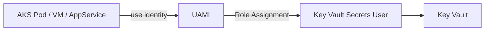
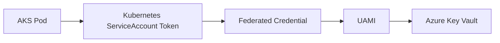

AKS에서 Key Vault 접근 구조를 이해할 때 가장 중요한 축은 `UAMI`와 `Workload Identity`다.

## **핵심 결론**
{: .mt-5 .mb-2}
- 화면에서 보이는 User Assigned Managed Identity(UAMI)는 독립적인 Azure 리소스다.
- UAMI는 생성만 해두면 아무 리소스에도 연결되지 않은 상태일 수 있다.
- 권한은 "리소스에 부여"가 아니라 보통 "UAMI에 Role Assignment"로 부여한다.
- 실제 접근 주체(AKS Pod/VM/App Service)는 그 UAMI를 사용해 권한을 행사한다.

## **Managed Identity 두 종류**
{: .mt-5 .mb-2}

### **System Assigned**
{: .mt-4 .mb-2}
- 특정 Azure 리소스에 1:1로 귀속
- 리소스 삭제 시 identity도 함께 삭제

### **User Assigned (UAMI)**
{: .mt-4 .mb-2}
- 독립 리소스
- 여러 리소스가 공유 가능
- 재사용/권한 분리에 유리

## **UAMI 권한 모델**
{: .mt-5 .mb-2}
일반적인 구성은 아래 순서다.

1. UAMI 생성
2. UAMI에 Role Assignment 부여 (예: Key Vault Secrets User)
3. 워크로드가 UAMI를 사용하도록 연결
4. 워크로드는 UAMI 권한으로 Azure 리소스 접근

## **헷갈리기 쉬운 포인트**
{: .mt-5 .mb-2}
- "UAMI를 특정 리소스에 꼭 attach해야만 권한이 생긴다"는 표현은 반만 맞다.
- 정확히는 **UAMI 자체에 권한을 붙이고**, 리소스는 그 UAMI를 사용한다.

즉:
- 권한의 주체 = UAMI
- 실제 실행 주체 = Pod/VM/AppService

## **AKS에서 Pod는 UAMI를 어떻게 쓰는가**
{: .mt-5 .mb-2}
AKS Workload Identity에서는 Pod에 UAMI를 직접 "attach"하는 방식이 아니라, 연합 신뢰(Federated Credential) 기반으로 연결한다.

흐름:
1. Pod가 ServiceAccount 토큰을 발급받음
2. Entra ID(구 Azure AD)와 Federated Credential 매칭
3. 연결된 UAMI로 토큰 교환
4. Azure SDK/CLI 호출 시 해당 UAMI 권한으로 Key Vault 접근

## **실무 권장 패턴**
{: .mt-5 .mb-2}
- 용도별 UAMI 분리
  - `secret-read-uami`: Key Vault secret read 권한
  - `cert-manage-uami`: 인증서 관리 권한
- 워크로드별 최소 권한 적용
- 네임스페이스/서비스별 ServiceAccount 분리

## **한 줄 정리**
{: .mt-5 .mb-2}
UAMI는 "권한을 담는 신원 리소스"이고, AKS Pod는 Workload Identity를 통해 그 신원을 사용해 Azure 리소스에 접근한다.
